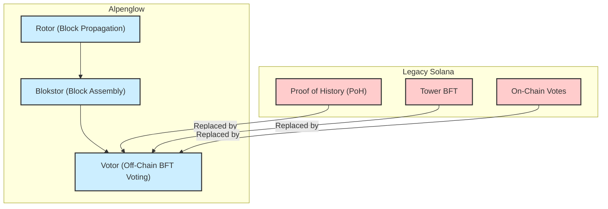
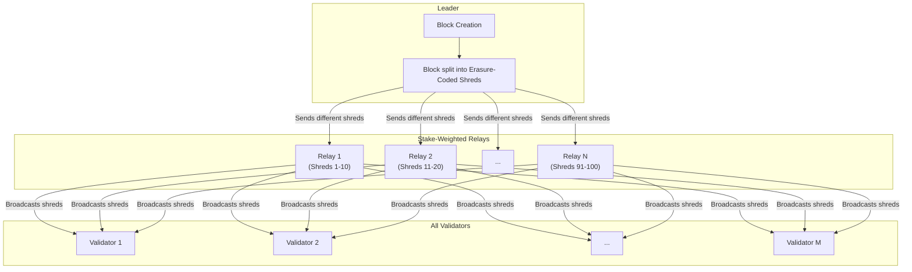
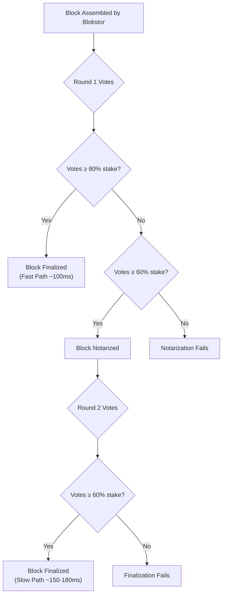

+++
title = "Alpenglow: A Look at Solana's Landmark Upgrade for Near-Instant Finality"
date = "2025-06-25"
tags = ["Solana", "Blockchain", "Consensus", "Alpenglow"]
draft = false
description = "A summary of Alpenglow, Solana's landmark upgrade for near-instant finality."
+++

> "We expect that Alpenglow can achieve actual finality in about 150 ms (median)."



This article summarizes Alpenglow, Solana's most significant upgrade, designed to slash transaction finality time. Alpenglow replaces legacy components like Tower BFT and Proof of History (PoH) to achieve block finality up to 100 times faster, targeting a median time of just 150 milliseconds.

<video width="100%" controls>
  <source src="/videos/alpen-sim.mp4" type="video/mp4">
  Your browser does not support the video tag.
</video>

### High-Level Changes

The diagram below shows the core architectural shift from Solana's legacy components to the new Alpenglow protocol.

### The Core Problem: Slow Finality

Previously, Solana's consensus mechanism, Tower BFT, required approximately 12.8 seconds to finalize a transaction, meaning it took that long for a transaction to be considered irreversible. This latency, while faster than many other blockchains, was a bottleneck. Alpenglow addresses this by completely overhauling the consensus and data propagation layers.

### Alpenglow's Key Innovations

Alpenglow's architecture is built on three primary components: Rotor, Blokstor, and Votor.

- **Rotor: High-Speed Block Propagation**
  Rotor is an evolution of Solana's Turbine protocol, responsible for sending new blocks from the leader to all validators. Its design is based on the insight that network latency, not bandwidth, is the primary bottleneck. It flattens Turbine's multi-layer tree into a single-hop relay system to minimize network hops. The process works as follows:

1. **Erasure Coding**: The leader takes a block and splits it into small pieces called "shreds." It then generates parity shreds using erasure coding, allowing the full block to be reconstructed from a subset of the shreds (e.g., 60 out of 100). This adds redundancy against packet loss.
2. **Stake-Proportional Relay**: Instead of sending all shreds to all validators, the leader sends different shreds to a selection of high-stake relay nodes. These relays, chosen based on stake weight and network proximity, then broadcast their shreds to the entire network in parallel.
3. **One-Hop Broadcast**: This model ensures most validators receive all necessary block data in a single network hop from the relays. This design uses the total available bandwidth of the network efficiently, as all nodes' upload capacity is utilized simultaneously. The relay assignments are also randomized to improve resilience.

- **Blokstor: Efficient Block Assembly**
  Each validator runs Blokstor, a specialized, high-speed data store that catches incoming shreds from Rotor.

  1. **Shred Assembly & Verification**: Blokstor receives shreds and verifies their integrity by checking the leader's signature and a Merkle proof confirming the shred belongs to the block. Once enough shreds are collected, it reconstructs the full block.
  2. **Event Emission**: Upon successful assembly, Blokstor emits an event to the Votor component, signaling that a candidate block is ready for voting. This decouples data propagation from consensus logic, allowing the voting process to begin as soon as a block is locally available. It can also handle shreds for multiple different blocks proposed for the same slot, holding them until one is chosen by consensus.

- **Votor: A Faster, Two-Path Voting System**
  Votor is the new BFT engine that replaces Tower BFT. It introduces a highly efficient, two-path voting process that occurs off-chain, eliminating the need for on-chain vote transactions and their associated fees.

- **Off-Chain Voting**: Votes are transmitted as lightweight UDP packets directly between validators. They are aggregated using Boneh-Lynn-Shacham (BLS) signatures into a compact certificate, which is the only part that is eventually anchored on-chain.
- **Two-Path Finality**: The two voting paths run concurrently to minimize latency:
  1.  **Fast Path (Single Round):** The protocol optimistically tries to finalize in one round. If a block receives votes from ≥80% of the stake very quickly (within ~100 ms), it is considered finalized immediately.
  2.  **Slow Path (Two Rounds):** If the 80% threshold isn't met but at least 60% of the stake votes for the block, it becomes "notarized." A second round of voting commences, and if that also achieves a ≥60% vote, the block is finalized. This path ensures finality even under less-than-ideal network conditions, typically within ~150-180 ms.
- **Timeouts & Skip Votes**: Instead of Proof of History, Votor uses a fixed 400 ms slot time managed by each validator's local clock. If a block doesn't arrive in time, validators issue a "Skip Vote." If 60% of the stake agrees, an empty slot is finalized, and the network moves to the next leader, ensuring liveness.

### A New Security Model: "20+20" Resilience

Alpenglow introduces a "20+20" resilience model. It guarantees safety if up to 20% of the network's stake is malicious (Byzantine) and maintains liveness even if an additional 20% of nodes are offline or unresponsive. This represents a deliberate trade-off, lowering the fault tolerance from the traditional 33% to gain significant speed and better handling of crash-faults.

### Simulated Performance and Impact

Simulations of Alpenglow show remarkable results:

- **Finality:** Achieves a median finality of **~150 ms**, an 80-fold improvement over Tower BFT. In optimal conditions (the "fast path"), finality can be as low as **~100 ms**, while the "slow path" ensures finality within **~150-180 ms**. Even for validators in distant geographical regions, finality is expected within ~270 ms.
- **Efficiency:** The removal of Proof of History hashing significantly reduces CPU load on validators. Moving votes off-chain eliminates vote transaction fees and shrinks the ledger's growth rate.
- **Throughput:** With consensus no longer a bottleneck, the network can support an average throughput of **~4,000 TPS** and peaks of up to **65,000 TPS**.

This landmark upgrade was led by renowned distributed systems researcher Professor Roger Wattenhofer (ETH Zurich), alongside his PhD students Jakub "Kobi" Sliwinski and Quentin Kniep at Anza. Their research positions Solana at the forefront of network latency innovation, aiming to deliver a user experience where transactions feel truly instantaneous.

---

Read the full white paper [here](https://drive.google.com/file/d/1y_7ddr8oNOknTQYHzXeeMD2ProQ0WjMs/view).
