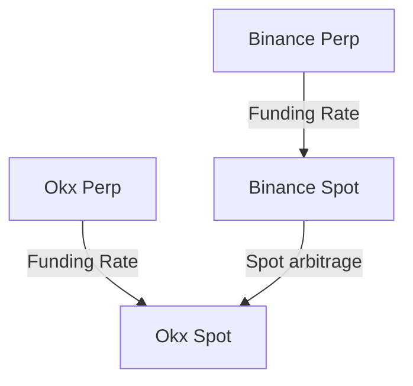
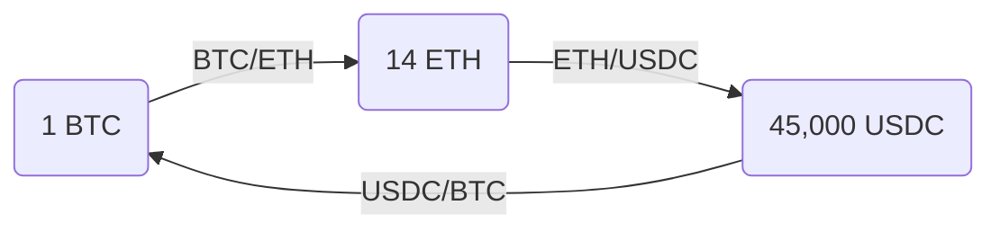

# Introduction

Let's start with the textbook basics - the definition. What is arbitrage afterall? Well, the dictionary will give you this definition:

> the simultaneous buying and selling of securities, currency, or commodities in different markets or in derivative forms in order to take advantage of differing prices for the same asset.

I'd say this is a fairly good definition for arbitrage in the traditional sense, but in the modern sense... I'm not really sure this is true. Most advanced arbitrage trading doesn't hedge the other side of the trade simultaneously at all. If you are in and out of the position in a couple seconds, then why would you even care about being hedged? Especially if you know that the side you are trading is the one doing all the moving.

- **Venue-specific market microstructure**: Understanding how each exchange's matching engine works, including order types, priority rules, and latency characteristics
- **Liquidity concentration analysis**: Using Level 2 data to identify where real liquidity sits versus displayed liquidity
- **Cross-venue correlation matrices**: Quantifying how price movements propagate between exchanges using techniques like Vector Autoregression (VAR) models
- **Flow toxicity detection**: Identifying when large players are moving markets versus normal retail flow

The mathematical foundation for this approach involves modeling the price impact function for each venue:

```
ΔP_i = α_i * (Volume/AverageVolume)^β_i * σ_i
```

Where ΔP_i is the expected price impact on venue i, α_i and β_i are venue-specific parameters, and σ_i is the recent volatility. Professional systems calibrate these parameters in real-time using recursive least squares or Kalman filtering.

Let's say we have two exchanges, ShitEx and MegaEx. MegaEx trades 500 billion USD a day. ShitEx trades about 500 million USD a day. If they diverge do you really expect that MegaEx and ShitEx will both meet in the middle? Probably not... In fact, ShitEx will do almost all of the moving, which we can round to 100% of the moving when we consider that we really only care about moves that occur in excess of our cost to trade (which is very non-trivial for this kind of trading).

This is just the introduction so we'll avoid diving into too much of the advanced weeds but you can already see from this example that the textbook definition isn't quite what arbitrage trading looks like in practice. In today's article, I will take a walk through all the different forms of arbitrage trading and what it realistically looks like to trade these opportunities. Not simply taking the textbook approach, but showing how real money gets made by professional arbitrageurs.

# Types of Arbitrage

There are many types of arbitrage outside of digital asset markets, but those tend to be quite complicated and require institutional levels of resources. The primary advantage of arbitrage in digital asset markets is the feasibility for even small teams / solo quants, something that is much rarer in traditional markets.

At a high level:

1. Funding Arbitrage
2. Spot Arbitrage
3. Dated Futures Arbitrage
4. Perpetuals Arbitrage
5. Triangular Arbitrage
6. Geographic Arbitrage

**For professional implementation, each strategy requires distinct infrastructure and risk management approaches:**

**Professional Strategy Classification Matrix:**

- **Latency-Sensitive**: Triangular, Perpetuals, Spot (requires <10ms execution)
- **Capital-Intensive**: Funding, Geographic (requires significant inventory management)
- **Research-Heavy**: Dated Futures, Geographic (requires fundamental analysis)

**Risk-Return Profiles (Professional Benchmarks):**

- Funding Arbitrage: 15-40% APR, Sharpe 3-8, Max DD <2%
- Spot Arbitrage: 50-200% APR, Sharpe 2-5, Max DD 5-15%
- Perpetuals Arbitrage: 100-500% APR, Sharpe 1.5-4, Max DD 10-25%
- Triangular Arbitrage: 200-1000% APR, Sharpe 1-3, Max DD 15-35%

**Infrastructure Requirements by Strategy:**

```python
STRATEGY_REQUIREMENTS = {
    'funding': {'latency': 'medium', 'capital': 'high', 'complexity': 'low'},
    'spot': {'latency': 'high', 'capital': 'medium', 'complexity': 'medium'},
    'perpetuals': {'latency': 'very_high', 'capital': 'low', 'complexity': 'medium'},
    'triangular': {'latency': 'very_high', 'capital': 'medium', 'complexity': 'high'}
}
```

Funding Arbitrage involves profiting from the funding payments paid out by perpetual contracts in order to keep them aligned with their index price. Typically it is done with a spot (long/short) position against the opposite position in the perpetual, this then accrues funding payments whilst they remain apart. It can also be done using a perpetual against another perpetual, this is less common and typically has more room for return, but also is harder to pull off. Especially when doing spot vs perp, funding arb is perhaps the simplest of all the arbitrage strategies to pull off and deliver a return with, but it is also one of the most capped in terms of profit potential. The returns will be broadly similar for all people running the strategy, especially when running it with serious size. Funding arbitrage is generally treated as the cash benchmark for most multi-strategy funds because it offers a reasonable return at a very high Sharpe. It's also fairly easy to rotate spare cash into, and doesn't require a lot of research to develop a sufficient strategy for.

Spot Arbitrage on the other hand is more competitive. It involves buying on one exchange and selling on another, earning the difference of those prices. You'll typically need to withdraw from one exchange and transfer to the other exchange in order to reconcile, meaning you may not be able to buy & sell at the same time on each. In some cases you may be able to get borrowing margin, but this is generally quite rare.

Dated Futures Arbitrage involves taking a position in spot (long/short) and then taking the opposite position in a dated future, and waiting until expiry (or convergence) to exit. It's fairly rare as the returns compared to funding arbitrage are typically worse and they tend to give higher volatility, however, in some circumstances the return can be quite exceptional. There are also concerns about the lack of liquidity with dated futures so it is only really relevant for smaller book sizes.

Perpetuals Arbitrage is between two perpetuals and bets on their convergence. It is technically a form of statistical arbitrage because you can't actually reconcile the positions, and they are completely different assets with different contract specifications and index prices. That said, they'll still converge as if they're the exact same asset in most cases. There are still mechanisms which keep them in place even if they are a bit more complicated than spot:



So they can't stay apart forever, but you also may have to face the margin man if you get blown out of your position. Typically this isn't too much of a worry as these trades tend to be fairly rapid and the size you can actually put on is a very small fraction of your portfolio.

Triangular Arbitrage or more technically circular arbitrage, is any conversion of spot assets that ends up back where you started and with more money. I call it circular arbitrage because you do not necessarily need 3 legs, you can have N legs s.t. N >= 3. I used to run this on Binance and it was very profitable for a while until the bear market hit and liquidity / volumes dried up in small caps.



Geographic arbitrage is basically spot arbitrage but for foreign exchange markets where you arbitrage local vs international markets for that currency. The reason it is technically a crypto strategy is because you usually buy up the currency on their local crypto exchanges because there is usually a really large imbalance of pricing there due to people using crypto to pull money out of the economy (when it may be quite a pain to do normally). This one is mostly an operational challenge and isn't an edge I'd recommend unless you love paperwork and arguing with foreign bureaucrats.

We'll dig into each of these strategies at a deep level of detail towards the end of the article.

# Where can "I" find alpha?

Sure, this is interesting to learn about, but I expect the real question you are asking yourself is where can I find alpha? The answer is usually on small exchanges, or during regimes where returns are exceptionally high.

## Professional Alpha Sourcing Framework

**Tier 1 Opportunities (Systematic Alpha):**

- **Emerging Exchanges**: Target exchanges with <$1B daily volume but growing >50% monthly
- **New Listing Arbitrage**: Monitor new token listings across exchanges (typical 2-6 hour inefficiency window)
- **Derivative Launch Arbitrage**: New perpetual/futures listings often have 24-48 hour pricing inefficiencies

**Tier 2 Opportunities (Regime-Dependent Alpha):**

- **Funding Rate Explosions**: Systematic monitoring for funding rates >100% APR (occurs ~6-8 times/year)
- **Liquidation Cascades**: Monitor margin call data for predictive signals
- **Cross-Chain Bridge Arbitrage**: Exploit temporary cross-chain pricing inefficiencies

**Professional Monitoring Infrastructure:**

```python
# Example alpha monitoring system
class AlphaMonitor:
    def __init__(self):
        self.exchanges = self.load_exchange_config()
        self.thresholds = {
            'funding_rate': 0.01,  # 1% funding rate threshold
            'spot_spread': 0.005,  # 0.5% spread threshold
            'volume_spike': 3.0    # 3x normal volume
        }

    async def monitor_opportunities(self):
        opportunities = []
        for exchange in self.exchanges:
            funding_data = await self.get_funding_rates(exchange)
            spot_data = await self.get_spot_prices(exchange)
            opportunities.extend(self.analyze_opportunities(funding_data, spot_data))
        return self.rank_opportunities(opportunities)
```

Especially on new and growing exchanges, you'll find the best alpha. This will be because of various reasons:

- Willing to offer you attractive fees
- Reward programs
- Lots of retail flow without established players on exchange yet
- Weak quoting from the exchange MMs who are under contract

## Professional Due Diligence for New Exchanges

**Technical Infrastructure Assessment:**

- API latency testing (measure p50, p95, p99 response times)
- WebSocket stability testing (monitor disconnection rates)
- Order execution quality analysis (slippage, rejection rates)
- Withdrawal reliability testing (time to process, failure rates)

**Liquidity Analysis:**

- Effective spread analysis across different times of day
- Market depth analysis (liquidity beyond best bid/ask)
- Price impact modeling for various order sizes
- Market maker behavior analysis (quote update frequency, depth changes)

**Risk Assessment Matrix:**

```python
EXCHANGE_RISK_FACTORS = {
    'technical': ['api_reliability', 'latency_stability', 'order_execution'],
    'operational': ['withdrawal_speed', 'customer_support', 'regulatory_status'],
    'financial': ['insurance_fund', 'segregated_funds', 'audit_status'],
    'market': ['liquidity_depth', 'maker_quality', 'volatility_handling']
}
```

**Integration Priority Framework:**

1. **Immediate Integration** (Risk Score <3): Established exchanges with clear competitive advantages
2. **Cautious Integration** (Risk Score 3-6): Emerging exchanges with good fundamentals but limited track record
3. **Monitoring Only** (Risk Score >6): High-risk exchanges requiring extensive due diligence

To address the last point on my list, you will be able to see it on many exchanges that the quotes will change in their distribution as the average markup changes. This is because most market makers like Jump trading will have a retail quoter and a normal quoter. The retail quoter expects retail counterparties and is designed to maximize the market making metrics such as time on top of book, depth of book, etc, but it isn't used to getting picked off. If you pick them off too aggressively they'll switch to the normal quoter. You should keep this in mind when exploiting arbitrages. If you hit it too hard you'll scare off the retail quoter. The retail quoter can be easily picked off whereas the professional quoter is close to impossible to pick off and is what they'll quote on Binance etc. Not all exchanges will have this characteristic, I know Jump does this (they're often your counterparty), but if you trade against smaller names in the MM as a service industry their quotes will usually just be soft and they won't have an automated switching - in fact they may just shrink their quotes and leave it that way, sometimes they may just eat the loss.

Regarding exchange reward programs, often you get rewarded for the volume you generate either as a maker or a taker. Perhaps the edge for arbitrage is roughly equal to the cost of trading, but then when you add the reward program you realize you are actually up 1 bp on every dollar of volume. Reward programs make any edge you can come up with much easier to monetize since the threshold is much lower, on top of this, you'll often get an integration stipend of anywhere from 20-50k. I've had ones in the 65-75k a month long, but those were for trading very specific products and didn't last very long. Typically anything above 20-30k is a great deal, and their availability will depend on the regime at the time. These usually are not advertised on the website so you'll need to be in talks with the exchange already for you to then tell you about it or be known as an MM in the industry. Regardless, it's basically free money to go and trade on the exchange, paid monthly usually for 3-6 months, but sometimes for longer than that.

Once you become one of the largest in terms of volume on that exchange, you can negotiate custom fees which will help your performance even more. This is a pretty common course of events I've seen happen on most small exchanges I did arbitrage trading on.

On top of this, there's sometimes regimes where you can find easy money. If you monitor the funding rates, they sometime jump up to the 100%+ APR range on simple Bybit BTC spot vs perp funding arbitrages and sit there for a few weeks, maybe once a year this will happen. When it does, it's worth harvesting the easy money. This is mainly just a matter of having the capital available to do this when the opportunity arises. Speaking of regimes - there's also some fairly large spikes in the arbitrage opportunities during major market events like the ETH merge and FTX collapse that create exceptional opportunities for prepared traders.

The reality is that if you are trading big exchanges vs another big exchange then you are probably really damn good already (or not making a dime). The bulk of the money that you can actually make without a large team comes from trading small exchanges vs big exchanges, the stuff that is small enough to get ignored by the best of the best. Pick up niche edges, not huge general edges. It's much better to have a real chance at making 500K-1m than no chance whatsoever at 100m+... certainly at the start at least.

## Execution

Having the right execution to profit from arbitrage opportunities is essential to actually make money doing arbitrages. Sure, for some slower moving opportunities you can be much sloppier on the execution, but especially for strategies like spot, perp, and triangular arbitrage you need to think about execution. Even when there are high volatility events and lots of arbitrages show up (and last for a while at abnormally large levels) the execution does matter because the spreads will be very wide. You probably would make money still in that scenario, but basic limit quoting into the trade helps your bottom line a lot.

**Latency Optimization Stack:**

```python
# Professional execution engine architecture
class ExecutionEngine:
    def __init__(self):
        self.connections = self.setup_connections()  # WebSocket connections
        self.order_router = OrderRouter()
        self.risk_manager = RiskManager()
        self.latency_monitor = LatencyMonitor()

    async def execute_arbitrage(self, opportunity):
        # Pre-execution checks
        if not self.risk_manager.check_limits(opportunity):
            return False

        # Optimal execution path
        execution_plan = self.order_router.plan_execution(opportunity)

        # Execute with monitoring
        results = await self.execute_plan(execution_plan)
        self.latency_monitor.record_execution(results)

        return results
```

**Advanced Order Types for Professional Execution:**

- **Iceberg Orders**: Hide large size while maintaining priority
- **TWAP/VWAP Algorithms**: For larger positions requiring market impact mitigation
- **Hidden/Reserve Orders**: Reduce information leakage
- **Fill-or-Kill (FOK)**: Critical for latency-sensitive triangular arbitrage
- **Immediate-or-Cancel (IOC)**: Standard for most arbitrage execution

**Professional Latency Budgets:**

- **Market Data Reception**: <1ms (co-located), <5ms (cloud)
- **Signal Generation**: <0.5ms
- **Order Generation**: <0.1ms
- **Order Transmission**: <1ms (co-located), <10ms (cloud)
- **Exchange Processing**: Variable (2-50ms depending on exchange)
- **Total Latency Target**: <10ms for competitive opportunities

**Infrastructure Considerations:**

- **Co-location**: Essential for tier-1 exchanges (Binance, FTX, etc.)
- **Multiple Geographic Regions**: Redundancy and latency optimization
- **Dedicated Hardware**: FPGA for ultra-low latency, high-end CPUs for complex strategies
- **Network Optimization**: Direct exchange connections, premium bandwidth providers\*\*

So what does great execution look like? Well, it's actually fairly similar to market making when you actually dig into it. You are executing into a position using limit orders. In fact, you can quote around Binance mid-price plus some spread and this will effectively end up capturing arbitrage differences as you'll look very tight when there is an arbitrage, but look very wide when the prices are aligned or the arbitrage is in the other direction. This doesn't even require maker orders as you can have orders in your own system that you don't show the market or even send to the exchange but do execute when the price crosses them (executing as a taker), this is similar to how a hitting machine works in market making.

Using limit orders to trade into your arbitrages is the default way of doing things, and taking should only occur when you believe the opportunity won't last for long enough to make into it, this is often not the case. In fact, the arbitrage opportunity is often created by the maker fill because without the maker fill there wouldn't be enough edge in the trade to turn a profit as a taker.

Execution isn't just about ensuring limit fills, it's also about being able to put lots of size into imbalances. Often when there is a dislocation, we don't want to just slam the price back into alignment, and especially for cases like funding arbitrages, we'll actually end up losing money if we do that since we rely on them paying part to earn funding. So a large part of execution is about trying to put size through an opportunity without moving the price, and as a corollary to that, figuring out the optimal amount of size to allocate before marginal utility actually starts to become negative for having more size in the trade (making the funding arbitrage converge for example).

## When should you hedge?

Hedging costs money and that's something that you'll find is really scarce when running arbitrages. Every basis point of edge counts, you are really skimming very fine lines, and hedging is a whopping DOUBLE the cost! But aren't I giving up half the edge? This is a common misconception, when most people think about arbitrages they think about two assets meeting in the middle, but the reality is that one asset does all the moving and the other doesn't move at all. Especially if you are finding edges on smaller exchanges, the small exchange will do all the moving and Binance won't budge an inch. If you are doing spot or perp arbs (not funding!) you probably shouldn't ever hedge, not unless it's a large deviation and you have to lay down a lot of your book to fill the size (and are being compensated well enough to not have to mind your bps!). Funding arbitrage will be different to this hedging rule obviously — the noise of asset price moves will drown your funding PnL. If you aren't holding for very long you really shouldn't be doing any hedging, it'll cost too much. The intuition here is that if you are trading enough and holding for short enough that the risk of any individual trade made by your algorithm averages out over the long run then there really isn't much of a need to go about hedging. Funding arb is the exception because you are holding for very long and it definitely will not average out if you stop hedging, some people do still play around with the way funding arbitrages are hedged, but they're still hedging — just in a different way (we'll get into this in a bit when we dive into funding arbitrage specifically).

## When You Have To Predict

In almost every arbitrage, there's an element of prediction. Thinking that with arbitrage there will be no guesswork is a mistake. For an overview of things you may need to guess:

1. How long a funding arbitrage lasts for?
2. Estimated liquidity when you actually trade?
3. Will a spot arbitrage still be there after I transfer my assets?
4. What is the estimated rate at which my arbitrages will fail?
5. When is the optimal time to enter into a perp arb?

**Funding Rate Decay Models:**

```python
# Professional funding rate decay prediction
class FundingDecayPredictor:
    def __init__(self):
        self.model = self.load_trained_model()
        self.features = [
            'current_funding_rate',
            'volume_ratio',
            'open_interest_change',
            'spot_perp_basis',
            'market_volatility',
            'time_of_day',
            'day_of_week',
            'market_regime'
        ]

    def predict_decay_rate(self, symbol, current_rate):
        features = self.extract_features(symbol)
        half_life = self.model.predict(features)  # Hours until 50% decay
        decay_constant = -np.log(0.5) / half_life
        return decay_constant

    def expected_pnl(self, entry_rate, position_size, holding_period):
        decay_rate = self.predict_decay_rate(symbol, entry_rate)
        expected_rate = entry_rate * np.exp(-decay_rate * holding_period)
        return position_size * expected_rate * holding_period / (365 * 24)
```

**Liquidity Prediction Models:**

- **Order Book Decay Functions**: Model how liquidity disappears after large trades
- **Market Impact Models**: Predict price impact based on order size and market conditions
- **Cross-Exchange Liquidity Correlation**: Model how liquidity changes propagate between venues

**Professional Risk Models:**

```python
# Value-at-Risk for arbitrage positions
class ArbitrageVaR:
    def __init__(self):
        self.confidence_level = 0.99
        self.lookback_period = 252  # Trading days

    def calculate_var(self, positions, correlation_matrix):
        # Calculate portfolio variance
        portfolio_variance = np.dot(positions.T, np.dot(correlation_matrix, positions))
        portfolio_std = np.sqrt(portfolio_variance)

        # VaR calculation
        var = stats.norm.ppf(self.confidence_level) * portfolio_std
        return var

    def scenario_analysis(self, positions):
        scenarios = [
            {'market_crash': -0.20, 'volatility_spike': 3.0},
            {'exchange_outage': {'duration': 2, 'affected_exchanges': ['binance']}},
            {'funding_shock': {'rate_change': 0.05, 'affected_symbols': ['BTC', 'ETH']}}
        ]

        results = []
        for scenario in scenarios:
            pnl_impact = self.simulate_scenario(positions, scenario)
            results.append({'scenario': scenario, 'pnl_impact': pnl_impact})

        return results
```

**Machine Learning Approaches:**

- **LSTM Networks**: For time-series prediction of funding rates and spreads
- **Random Forest**: For classification of profitable vs unprofitable opportunities
- **Reinforcement Learning**: For optimal entry/exit timing
- **Ensemble Methods**: Combining multiple models for robust predictions\*\*

These are just a handful, but they can make a big difference on your PnL. In fact, for funding arbitrages the prediction actually matters more than the starting value. Say you have a coin with a 1300% APR funding rate. That may only be worth 800% after you deploy your size and move the price, and then after you take into account that it'll only last 1 day (according to your forecast model) you are left with only a handful of bps in returns, which can quickly become negative after you incorporate your transaction costs (which may also be high because it's probably very illiquid if the funding is this high). If you don't want to do this, trade big symbols on big exchanges only, otherwise get ready to do some forecasting, improving your model for estimating how long a funding arbitrage will last for example is one of the best ways to improve your edge. I'll talk a bit more about how this can be done in the funding arbitrage specific section.

## Incompletes

Incompletes are when one leg of your trade fills, but the other doesn't. This can end up being quite the expense if the rate of incompletes rises too much. Obviously, if you aren't hedging then there isn't a leg to be incomplete, but for spot arbitrages and triangular arbitrages you will almost always have to reconcile the other end. There's no partially doing a triangular arbitrage or you'll end up in some random currency you don't want.

As we discussed in the prediction section, you will need to predict when incompletes occurred. When I was trading arbitrages, I had to model on which exchanges and which types of trades and even which symbols incompletes occurred the most on. This reveals some staggeringly large concentrations in my incompletes that meant some traders were losers on average, and thus avoidable by not trading those types of setups.

Not just that, when we dug into how the incompletes were forming we realized that often stale data was causing us to miss legs, and after some system changes we resolved a large amount of incompletes in the system. These sorts of investigations that help you to optimize your PnL, and milk more from the arbitrages you are trading.

## Normalization

Normalization is relevant specifically for funding arbitrages and perpetual arbitrages in order to accurately compare the two products. You can use an EWMA of the spread to normalize for sustained differences in the mean when doing perpetual arbitrage, and this is fairly effective (and good practice), but you will still have to deal with issues related to funding rates. Paraphrasing from my prior article on perpetual arbitrages which I think covers the topic of normalization quite nicely (so no point rewriting):

Using Binance's perpetual prices directly is not optimal, especially for platforms with shorter perpetual durations, like hourly ones on DEXs. This is because perpetual prices tend to converge towards the spot price in a pattern that resembles descending stairs until a funding payment occurs, which then causes a jump. We don't want to make trades that get us into a bad position on funding payments.

An alternative approach of relying solely on spot prices is also flawed. It may lead to imbalanced positions, favouring underperforming coins while shorting the surging ones. A potential solution is to "clean" the perpetual prices from a platform like Binance by accounting for accrued but unpaid funding payments, adjusting for rate differences, and then subtracting the accrued coupon for the specific platform you're converting to.

This method is only moderately effective due to various challenges:

1. Different indices used across platforms can lead to discrepancies, especially during volatile market conditions.
2. There are limits on how high funding payments can go, which vary by exchange.
3. Funding rates change frequently, affecting the conversion due to the non-linear nature of common funding formulas.
4. Practical implementation issues, such as determining accrued funding payments and adjusting for rate differences, considering the intricacies of funding rate formulas.

The closest approach to a practical solution involves taking Binance's perpetual prices, adjusting for accrued funding payments and rate differences, and then recalculating the funding payments.

However, there's no one-size-fits-all formula for this, and you'll turn off specific exchange pairs or increase their entry thresholds in your system to try to counter this.

An ideal strategy involves analysing data to understand how funding payments evolve relative to premiums and devising cross-venue adjustments based on empirical evidence.

This should include models for predicting how spot prices will converge across different venues. These are mostly driven by relative volumes on each exchange.

We want to remember the notion of confidence throughout. If we deem two perp, to be very similar, we can give a higher confidence to it and then size up on a divergence to a greater extent. How that score is developed is up to you as the reader, but generally, it should include components like interval, index price formula, funding limits, and accrual formula.

In any of these trades, the funding rate can play a significant role in divergence if contracts are misaligned. Thus, we should take these into account for our final live version.

## Reducing Trading Costs

Fees are a huge part of the costs you will have when you are trading and they can usually be reduced quite easily. Switching to making will give you quite a big improvement in fees from the start, even if you are on the worst tier, the improvement by switching to maker is fairly significant.

You used to be able to use a prime broker if you wanted better fees, but nowadays that doesn't work since fees are typically decided at a sub-account level, and not an account level by the top exchanges - this means prime brokers aren't very useful for this.

That said, if you need access to top fees, most SMA firms, especially those that focus on HFT will have top fee accounts. For some detail on what an SMA is, it's a separately managed account. It's similar to a hedge fund investor except instead of needing to set up a hedge fund legal structure, they just give you the key to the account and you trade their account with some contract in place which outlines compensation.

It's a fairly common, and lightweight structure, and by trading through their account you'll have access to the top fees. That said, you still need the connections to get SMA investors and the returns to back it up.

For smaller exchanges, they'll be willing to start you off on a trial for quite a bit of time at a top fee tier, and you can then use this to kickstart your volumes on said exchange. It shouldn't matter for smaller exchanges whether you have an SMA or not since it's fairly easy to become one of the top traders by volume. You'll only need an SMA if you are looking to trade on a top exchange - which as we discussed earlier isn't always ideal in terms of execution and hedging.

### Trading more things

This should be one of the more obvious ways to improve your PnL, but it is an important part of the decision making process, and that is - trading more things. Things: being exchanges, symbols, or types of instruments. Already got lots of symbols? Add another exchange! Already have lots of exchanges? Add coin margined perpetuals instead of just normal perpetuals!

This is probably one of the most common ways to ensure you are fully milking an opportunity. There is often a balancing act between trading better execution / general trading logic vs. integrating more exchanges. It really depends on the situation but either logic improvement, nor the opportunity to add the latest exchanges should be ignored in full favour of the other.

### Leverage & Borrowing

When you hit the double digits in terms of Sharpe ratios, it starts to no longer matter about the risk side of things and you start to think about things in terms of the absolute dollar amount of return possible. One component of this is that it now becomes very easy to lever up the strategy because the risk component is fairly low. For many small traders, the capital component of the equation is sparse so leverage is a great way to acquire leverage you can get it directly through perpetuals which will typically let you get extremely levered, but this comes with it's own risks if you put this cross-exchange. A lot of people and their blowing their roofs up because the market moves 45% down and suddenly they're down 2 mill on one exchange and up 2 mill on another exchange. That hedged position becomes not so hedged anymore and you start getting liquidated on one side of the trade. Modelling your leverage across all sorts of shock scenarios where we assume various assets have big sudden moves that we won't have time to get out of the way of is extremely important or you will blow up your book. For more detail on how to calculate the shocks, take a look at the way Deribit calculates margin for options - that should be fairly instructive.

**Advanced Cross-Exchange Risk Management:**

```python
class CrossExchangeRiskManager:
    def __init__(self):
        self.max_leverage = 5.0  # Conservative for cross-exchange
        self.margin_buffers = {
            'binance': 0.15,    # 15% buffer above maintenance margin
            'ftx': 0.20,        # 20% buffer for less liquid exchanges
            'bybit': 0.18
        }
        self.correlation_matrix = self.load_correlation_matrix()

    def calculate_portfolio_var(self, positions):
        """Calculate portfolio Value-at-Risk across exchanges"""
        # Adjust for cross-exchange basis risk
        adjusted_correlation = self.adjust_for_basis_risk(self.correlation_matrix)

        # Calculate portfolio variance with correlation
        portfolio_var = 0
        for i, pos_i in enumerate(positions):
            for j, pos_j in enumerate(positions):
                portfolio_var += pos_i * pos_j * adjusted_correlation[i][j]

        return np.sqrt(portfolio_var) * 2.33  # 99% confidence

    def stress_test_scenarios(self, positions):
        """Professional stress testing scenarios"""
        scenarios = {
            'crypto_winter': {'btc': -0.80, 'eth': -0.85, 'alts': -0.95},
            'exchange_hack': {'exchange_down': 48, 'price_impact': -0.30},
            'funding_shock': {'funding_spike': 0.10, 'duration': 24},
            'liquidity_crisis': {'spread_widening': 5.0, 'depth_reduction': 0.70}
        }

        results = {}
        for scenario_name, scenario in scenarios.items():
            pnl_impact = self.simulate_scenario(positions, scenario)
            results[scenario_name] = pnl_impact

        return results
```

**Professional Borrowing Strategies:**

- **Prime Brokerage Leverage**: 2-5x leverage at institutional rates (50-200 bps)
- **DeFi Leverage**: Compound, Aave integration for spot borrowing at competitive rates
- **Exchange Native Margin**: Cross-margin vs isolated margin optimization
- **Repo Markets**: Overnight and term funding for large positions

**Dynamic Leverage Sizing:**

```python
def optimal_leverage(expected_return, volatility, sharpe_ratio, max_drawdown_tolerance):
    """Kelly Criterion adapted for arbitrage strategies"""

    # Modified Kelly for non-normal returns
    if sharpe_ratio > 2.0:
        # High Sharpe strategies can use more aggressive sizing
        kelly_fraction = (expected_return / volatility**2) * 0.75
    else:
        # Conservative Kelly for lower Sharpe
        kelly_fraction = (expected_return / volatility**2) * 0.25

    # Cap leverage based on drawdown tolerance
    max_leverage_dd = max_drawdown_tolerance / (2 * volatility)

    return min(kelly_fraction, max_leverage_dd, 10.0)  # Cap at 10x
```

**Professional Margin Management:**

- **Real-time Margin Monitoring**: Cross-exchange margin utilization tracking
- **Automated Deleveraging**: Systematic position reduction during stress
- **Cross-Exchange Netting**: Optimize margin usage across venues
- **Dynamic Hedging**: Real-time delta and gamma hedging for large positions\*\*

To acquire spot leverage, you can borrow from the exchanges (which is typically quite expensive) or you can take out loans from external providers. Most prime brokers will offer you leverage as well as certain loan facility firms like Tesseraact which will write the debt against your book as a company (i.e. there is no liquidations here, you are taking on the debt directly as a company after showing them your books).

Borrowing isn't just about leverage though, it can also be about hedging. You often want to ensure you can hedge your buys on one exchange with a sell on another exchange, but for spot markets that means you need to get short on the other exchange. To get around this, you'll need to get spot borrow on the short exchange. Getting spot borrow is typically very expensive and only really worth it in huge dislocations where hedging becomes quite important (ie when the market breaks down), but even in those scenarios it struggles to make sense since there will be a scarce ability to acquire it. However, there is an exception, and that is funding arbitrages. In bear markets, the relationship tends to flip such that the future is usually below spot instead of above. This means that you will be longing the future and shorting spot. This requires the acquisition of spot borrow which can be acquired either on-chain or directly from the exchange. Funding arbitrage is the main strategy where spot borrow actually can play a critical role in whether it works out. With that said, funding arbitrage tends to be a lot less profitable in bear markets because spot borrow is much more expensive than shorting a future. When you short the future you get paid, and you pay nothing when you long spot, but when you short spot you have to pay and you get paid on the funding, so you end up with less profits in bear markets on funding arbitrages (which is one of the reasons why it is such a regime dependent strategy).

### Funding Arbitrage

Funding arbitrage can be done two ways. Either perp-perp or spot-perp.

Perp-perp is usually exclusively cross-exchange, and spot-perp can be either although it tends to be single exchange unless there is no spot market on the exchange. The reason for this is that spot prices will tend to be fairly equal across exchanges whereas perp funding rates will differ so you tend to just pick the easiest spot hedge (which tends to be on the same exchange as your perp for margin related reasons). Sometimes, you get exchanges which are exclusively perpetuals or they have terrible liquidity in their spot markets.

Bybit was like this when Bybit Spot had just opened and also before it was available. There was great trading in Bybit perpetuals but no liquidity (or before spot, no assets) for you to trade in the spot markets to cross-exchange was required. I bring this up because on Bybit, and other exchanges they often list the perpetual before the spot asset so you may still find that you need to do cross-exchange spot-perp arbitrages.

Typically, hedge funds will do exclusively single exchange trading because it's close to impossible to end up getting liquidated doing it whereas cross-exchange you can easily get liquidated if you don't manage your risk and because of this risk characteristics their investors will be very unhappy if they run anything cross-exchange. Generally, it's quite hard to raise for and tends to be run more by proprietary trading shops. Another reason proprietary trading firms tend to run cross-exchange over single exchange is because there is much more turnover on cross-exchange and thus they need to run less size and have better execution - both characteristics of most proprietary trading operations (smaller books, HFT desks they can pass flow into for execution).

On the **Execution** front, we will have 2 legs to our trade and thus can start with making into the first leg, and making out when we decide to exit. This is a very easy way to start improving the execution, if you do the full trade to take then your execution will be extremely sub-optimal. From here, most firms will then start making on the second leg as well, but perhaps with a bit more aggression than the first leg. There's quite a bit of time to put the position on so it's very well suited for making. The only reason we will want to be more aggressive on the second leg is because now we have an unhedged position on and our risk level should be reduced by putting on the second leg.

For the **Prediction** component of funding arbitrages, you will need to model how long the arbitrages will last and the rate at which they decay. Typically there will be some function you create which models the rate at which the opportunities decay towards some long-term mean. You can include variables such as the current volatility and the option market's expectation of volatility in this model as well as how much the overall market has gone up recently as part of this modelling, but generally you.

Another part of modelling you'll need to do for your decision making logic will be around the optimal amount of size to put through a trade. You need to find the amount that maximizes $ profit, subject to some minimum return constraint (perhaps measured relative to other opportunities). Maximizing profit at 5% APR isn't a very great move, but we also are willing to give up some of the APR in order to put significantly more size into it.

There are some modelling components to risk (not that it's prediction, but I'll include it next to it), but that's more a matter of simulating some large shocks and you should be fine beyond that. Just follow the way Deribit calculates margin for options in terms of how you shock your portfolio (minus the options volatility shocks of course!) and that will be a reasonable worst case loss model (although I would increase the market moves up/down for assets). Perhaps you would want to scale this with volatility of each coin as well. Just be intentionally conservative. Pushing your luck on risk will never end well.

In terms of **trading more things**, this is fairly simple. You just add more exchanges and make sure they are liquid and that you avoid any wash flow. Then from here make sure you are trading all the liquid coins on an exchange, and maybe even the illiquid coins but on smaller size. Some firms won't bother with the illiquid coins, and some firms will focus specifically on the illiquid coins. Illiquid coins tend to have much much higher APRs, but the capacity is practically ignore-able for the kinds of firms looking to put low 9 figures through funding arbitrage trades.

Leverage wise you can get most of the leverage you need from perpetuals, but if you need spot borrow for the bear market direction of funding arbitrages then scouring DeFi sources of on-chain borrow is one great way to find alpha.

If you want even more detail on how to do funding arbitrages as well as some examples, then check out this article which goes into additional detail:

### Spot Arbitrage

Spot arbitrage is the oldest form of arbitrage in cryptocurrency markets. It's also got quite a few more barriers than perpetual arbitrage because you often need to think about operational aspects like withdrawals and transfers. In fact, you often can't hedge on the other exchange either or trade one side of the arbitrage without holding inventory or getting borrow. For this reason, spot is probably one of the most complicated out of all of the arbitrage strategies. That said, it's probably the one with the best moat out of all of them — i.e. the longest time to decay in terms of what I've seen.

For **Execution**, you typically don't have to be as aggressive as triangular arbitrage, but it is still far more aggressive than funding arbitrage. You will be doing the usual method discussed for execution such as making into the position, and ideally ending up trading purely on the smaller exchange but quoting in reference to the prices on the bigger exchange. This does not always work though, and sometimes we cannot rely on convergence to make our money.

In these cases we need to rely on moving cross-exchange transfers to reconcile the arbitrage between the exchanges directly. This requires us to build up a position on one exchange, and then when it is high enough we transfer it over to the larger exchange, and take the position off. We then transfer the resulting proceeds (either USDT or the coin depending on the direction of the arbitrage) back to our smaller exchange so that this capital can be used in more arbitrages.

This introduces a threshold problem for our modelling because there is a fixed cost to transfer between exchanges (most exchanges charge a flat fee and not a % of the value as a withdrawal fee). You also need to model how long the arbitrage will last or at least the rate it will decay at because if you build up a large position and then the arbitrage is gone before you get to transfer then you will lose all your PnL. On top of this, you need to model the expected rate of incompletes and the cost of these incompletes when determining whether you think an opportunity is profitable.

If you want even more detail on how to do spot arbitrages as well as some examples, then check out these 2 articles which goes into additional detail:

# Perpetuals Arbitrage

Perpetuals Arbitrage is probably the easiest arbitrage strategy to get started without that you can generate serious returns with. Sure, funding arbitrage is easier, but it's very hard to make serious money on fairly minimal capital with. Funding arbitrage, of course, can be used to deploy lots of capital at a great rate of return, but it's close to impossible to hit the 2000% returns that some traders produce on their capital with higher turnover arbitrage opportunities like perpetual arbitrage.

The reason I say it is the easiest is because unlike spot and triangular arbitrage there are far less moving parts, and no aspects related to availability of spot borrow, inventory requirements, withdrawal cost (causing threshold optimal problems), and transfer times. It also lacks the operational challenges you have to deal with when doing geographic arbitrages.

### Prediction

Prediction wise you need to determine the optimal point where you should trade into the spread and the expected rate of incompletes that you will hit. The rate of incompletes tends to vary between exchange combinations you are trading and even the time of the day, you should spend a lot of time analysing the incompletes so that you avoid missed / unprofitable trades. At minimum, you should have a baseline expectation of the cost from incompletes that is factored into your minimum trade profitability threshold.

### For execution

For execution, it's fairly similar to spot in that you need to use maker orders for at least one leg in the ideal case. You will notice that some opportunities are slower than others depending on the exchange. Often if an opportunity has already been around for a couple of seconds, the probability of it staying around for a another couple of seconds is quite high. I.e. the longer an opportunity has lasted, then the longer you can expect to have to trade into an opportunity and the lower your expected incomplete rate will be. Whereas, if an opportunity has just showed up on your scanner, there's a very high chance someone beats you to it if you aren't trading on a very uncompetitive exchange (which is of course another way to approach). If you can't keep up on the latency front then consider trading the slower opportunities. This rule also applies to spot when you are trying to determine the expected rate of decay — sometimes waiting is better than trading. There are other reasons to wait which relate to the deviation perhaps getting wider and you leaving money on the table by entering early — however you tune this usually by solving for the optimal setting for maximum profit in your (hopefully realistic) simulator. It's a simple grid search across parameters.

On the risk front, we've already discussed the risk of blowing up across exchanges if you use too much leverage. Especially if a large jump has occurred, you may see exchanges depart from one another. You may want perpetuals to get back in line with one another.

If you want even more detail on how to do futures arbitrages as well as some examples, then check out these 2 articles which goes into additional detail:

# Triangular Arbitrage

Triangular arbitrage is one of the more neglected types of strategies in my opinion. Even on Binance back in 2020/2021 I was able to capture significant profits trading triangular arbitrage, and even back then Binance was very efficient so this was fairly surprising. Especially when run in a cross-exchange and maker focused angle I think it would likely still work across various exchanges. Triangular arbitrage when run cross-exchange has the benefit of also capturing spot arbitrages quite optimally so there is a lot of overlap with spot arbitrage.

### In terms of the Execution

In terms of the Execution for triangular arbitrage, typically you will make into the first leg of the trade. It's practically impossible to make money going full taker in triangular arbitrage because of the number of illiquid legs. In fact, ideally you do maker on the 2nd leg as this tends to be the most illiquid out of all the legs.

Typically, there is not much of a statistical or modelling element to triangular arbitrages. The only bit of modelling I used to have to do when I ran it was modelling how liquidity would disappear after a maker fill on the first leg. I could tell it wasn't an other trader beating me to it because there was no trades occurring, instead it was likely market makers widening their quotes in response to a large impact on the COIN/USDT symbol for the coin (since this was COIN/BTC or /ETH or /BNB or /BUSD they were were widening on). I would use the rule that roughly half of the liquidity would be gone by the time I go there, although this rule eventually shrunk as I got faster at it.

### On the risk front

On the risk front, you often need to hold inventory in the coin if you want to quote both sides of the book. This is one of the bigger challenges for triangular arbitrage. The buy side of the book is easy because you can quote bids from USDT, and similarly you can take against the ask from holding USDT, but if you want to take against the bid or quote asks then you need to be holding the coin itself. This then necessitates you hold inventory. Ideally, this is done selectively based on where the opportunities lie with an overall beta hedge in a more liquid asset's perpetuals, but it causes a lot of risk and takes up lots of capital to pull off so it is recommended to only start on the buy side of the trade. When I was trading triangular arbitrage, I found that whilst the sell side of the trade was slightly riskier, it didn't appear to be a huge difference. That said, this was not so true of the spot arbitrages where the sell side was often 2x as risky when I explored those so perhaps these observations are now outdated.

**Advanced Inventory Management:**

```python
class TriangularInventoryManager:
    def __init__(self):
        self.target_inventory = {}  # Target inventory levels by asset
        self.risk_limits = {}       # Maximum inventory exposure per asset
        self.hedge_ratios = {}      # Beta hedging ratios for each asset

    def optimize_inventory_allocation(self, opportunities):
        """Optimize inventory allocation across potential triangular arbs"""
        # Expected opportunity frequency by asset
        opportunity_freq = self.calculate_opportunity_frequency(opportunities)

        # Risk-adjusted return per unit of inventory
        risk_adj_return = {}
        for asset in opportunities:
            expected_return = opportunity_freq[asset] * self.avg_profit_per_trade[asset]
            inventory_risk = self.calculate_inventory_risk(asset)
            risk_adj_return[asset] = expected_return / inventory_risk

        # Allocate inventory proportional to risk-adjusted returns
        total_capital = self.available_capital
        allocations = {}
        total_weight = sum(risk_adj_return.values())

        for asset, return_ratio in risk_adj_return.items():
            weight = return_ratio / total_weight
            allocations[asset] = total_capital * weight * self.leverage_factor

        return allocations

    def dynamic_hedging_strategy(self, inventory_positions):
        """Implement dynamic hedging for inventory risk"""
        hedge_orders = []

        for asset, position in inventory_positions.items():
            if abs(position) > self.risk_limits[asset]:
                # Calculate optimal hedge size
                beta = self.get_beta_to_btc(asset)
                hedge_size = position * beta * self.hedge_ratios[asset]

                # Create hedge order in BTC perpetual
                hedge_order = {
                    'symbol': 'BTCUSDT',
                    'side': 'sell' if hedge_size > 0 else 'buy',
                    'size': abs(hedge_size),
                    'type': 'hedge'
                }
                hedge_orders.append(hedge_order)

        return hedge_orders
```

**Professional Execution Strategies:**

- **Multi-Leg Atomic Execution**: Use exchange-specific order types for simultaneous execution
- **Partial Fill Handling**: Sophisticated incomplete trade management
- **Liquidity Aggregation**: Combine order book depth across multiple price levels
- **Smart Order Routing**: Dynamic routing based on real-time execution quality metrics

**Risk Metrics for Professional Operations:**

```python
def calculate_triangular_risk_metrics(positions, market_data):
    """Professional risk metrics for triangular arbitrage"""

    # Inventory-at-Risk (IaR)
    inventory_var = np.sum([pos**2 * market_data[asset]['volatility']**2
                           for asset, pos in positions.items()])
    inventory_at_risk = np.sqrt(inventory_var) * 2.33  # 99% confidence

    # Path-dependent risk (risk of incomplete triangles)
    path_risk = calculate_path_dependency_risk(positions)

    # Liquidity risk (risk of market impact)
    liquidity_risk = calculate_liquidity_risk(positions, market_data)

    # Total risk
    total_risk = np.sqrt(inventory_at_risk**2 + path_risk**2 + liquidity_risk**2)

    return {
        'inventory_at_risk': inventory_at_risk,
        'path_risk': path_risk,
        'liquidity_risk': liquidity_risk,
        'total_risk': total_risk,
        'risk_adjusted_return': expected_return / total_risk
    }
```

**Professional Opportunity Detection:**

- **Graph-Based Arbitrage Detection**: Use graph algorithms to find optimal N-leg arbitrages
- **Real-Time Cycle Detection**: Identify profitable cycles as they emerge
- **Cross-Exchange Triangle Optimization**: Optimize triangles across multiple exchanges simultaneously
- **Dynamic Path Selection**: Choose optimal execution paths based on current market conditions\*\*

### On the latency front

On the latency front we can optimize the latency of most taker triangular arbitrages by detecting when the price is near the threshold for when we would want to trade, and then spam limit IOCs at the price where there would be an arbitrage, especially if we think that the price will approach this quite soon. It will soak up our rate limit so you ideally would want to get special rate limit increases on the exchange / ensure that this is an especially good opportunity, but it's a latency trick which is practically unbeatable in terms of speed. You'll have the fill before anyone even has the data packet.

If you want even more detail on how to do triangular arbitrages as well as some examples, then check out this article which goes into additional detail:

## Professional Implementation Guide: Triangular Arbitrage Systems

### Mathematical Foundation and Graph Theory

Triangular arbitrage opportunities can be mathematically represented as negative-weight cycles in a currency graph. For professional implementation, we model this as:

```python
import networkx as nx
import numpy as np
from collections import defaultdict

class TriangularArbitrageDetector:
    def __init__(self):
        self.graph = nx.DiGraph()
        self.price_matrix = defaultdict(dict)
        self.min_profit_threshold = 0.001  # 0.1% minimum profit

    def update_prices(self, symbol_prices):
        """Update the price graph with latest market data"""
        for symbol, data in symbol_prices.items():
            base, quote = symbol.split('/')

            # Add edges for both directions
            if data['bid'] > 0:
                self.graph.add_edge(quote, base, weight=-np.log(data['bid']),
                                  price=data['bid'], side='buy')
            if data['ask'] > 0:
                self.graph.add_edge(base, quote, weight=-np.log(1/data['ask']),
                                  price=data['ask'], side='sell')

    def find_arbitrage_cycles(self):
        """Use Bellman-Ford algorithm to detect negative cycles"""
        try:
            # Bellman-Ford will raise exception if negative cycle exists
            nx.bellman_ford_path_length(self.graph, 'USDT')
            return []
        except nx.NetworkXUnbounded:
            # Negative cycle detected, extract profitable paths
            return self.extract_profitable_cycles()

    def extract_profitable_cycles(self):
        """Extract and validate profitable arbitrage cycles"""
        cycles = []
        for cycle in nx.simple_cycles(self.graph):
            if len(cycle) >= 3:  # Minimum triangular
                profit = self.calculate_cycle_profit(cycle)
                if profit > self.min_profit_threshold:
                    cycles.append({
                        'path': cycle,
                        'profit': profit,
                        'execution_plan': self.create_execution_plan(cycle)
                    })
        return sorted(cycles, key=lambda x: x['profit'], reverse=True)
```

### Advanced Execution Architecture

Professional triangular arbitrage requires sophisticated execution management to handle the multi-leg nature and timing constraints:

```python
class ProfessionalTriangularExecutor:
    def __init__(self, exchange_clients):
        self.exchanges = exchange_clients
        self.risk_manager = TriangularRiskManager()
        self.execution_monitor = ExecutionMonitor()
        self.inventory_manager = TriangularInventoryManager()

    async def execute_triangular_arbitrage(self, opportunity):
        """Execute triangular arbitrage with professional risk management"""

        # Pre-execution validation
        if not self.risk_manager.validate_opportunity(opportunity):
            return {'status': 'rejected', 'reason': 'risk_limits'}

        # Inventory check and allocation
        required_inventory = self.calculate_required_inventory(opportunity)
        if not self.inventory_manager.check_availability(required_inventory):
            return {'status': 'rejected', 'reason': 'insufficient_inventory'}

        # Execute with sophisticated order management
        execution_results = await self.execute_multi_leg(opportunity)

        # Post-execution analysis and inventory rebalancing
        await self.post_execution_analysis(execution_results)

        return execution_results

    async def execute_multi_leg(self, opportunity):
        """Execute multi-leg arbitrage with optimal timing"""
        legs = opportunity['execution_plan']
        results = []

        # Execute first leg (usually the most liquid)
        first_leg = legs[0]
        first_result = await self.execute_leg(first_leg, priority='immediate')
        results.append(first_result)

        if first_result['status'] != 'filled':
            return {'status': 'failed', 'reason': 'first_leg_failed', 'results': results}

        # Execute remaining legs with adjusted sizes based on first leg fill
        actual_size = first_result['filled_size']

        for i, leg in enumerate(legs[1:], 1):
            adjusted_leg = self.adjust_leg_size(leg, actual_size, i)
            leg_result = await self.execute_leg(adjusted_leg, priority='urgent')
            results.append(leg_result)

            # If any leg fails, implement damage control
            if leg_result['status'] != 'filled':
                await self.damage_control(results, legs[i+1:])
                break

        return {'status': 'completed', 'results': results}
```

### Real-Time Market Microstructure Analysis

Professional triangular arbitrage systems must understand and adapt to market microstructure:

```python
class MarketMicrostructureAnalyzer:
    def __init__(self):
        self.order_book_analyzer = OrderBookAnalyzer()
        self.liquidity_predictor = LiquidityPredictor()
        self.impact_model = MarketImpactModel()

    def analyze_execution_quality(self, symbol_pair, intended_size):
        """Analyze expected execution quality for triangular arbitrage leg"""

        order_book = self.order_book_analyzer.get_current_book(symbol_pair)

        # Calculate effective spread and market impact
        effective_spread = self.calculate_effective_spread(order_book, intended_size)
        market_impact = self.impact_model.predict_impact(symbol_pair, intended_size)

        # Analyze liquidity depth and resilience
        liquidity_metrics = {
            'depth_at_bps': self.calculate_depth_at_bps(order_book, [5, 10, 25, 50]),
            'order_book_imbalance': self.calculate_imbalance(order_book),
            'recent_volatility': self.get_recent_volatility(symbol_pair),
            'average_trade_size': self.get_average_trade_size(symbol_pair)
        }

        # Predict post-trade liquidity recovery
        recovery_time = self.liquidity_predictor.predict_recovery_time(
            symbol_pair, intended_size, liquidity_metrics
        )

        return {
            'effective_spread': effective_spread,
            'market_impact': market_impact,
            'liquidity_metrics': liquidity_metrics,
            'recovery_time': recovery_time,
            'execution_score': self.calculate_execution_score(
                effective_spread, market_impact, liquidity_metrics
            )
        }

    def calculate_optimal_leg_sequence(self, triangle_opportunity):
        """Determine optimal execution sequence based on microstructure"""
        legs = triangle_opportunity['legs']

        # Analyze each leg's execution characteristics
        leg_analysis = {}
        for i, leg in enumerate(legs):
            leg_analysis[i] = self.analyze_execution_quality(
                leg['symbol'], leg['size']
            )

        # Optimize sequence based on:
        # 1. Liquidity (start with most liquid)
        # 2. Market impact (minimize cumulative impact)
        # 3. Timing sensitivity (fastest recovery first)

        sequence_scores = []
        for perm in itertools.permutations(range(len(legs))):
            score = self.score_execution_sequence(perm, leg_analysis)
            sequence_scores.append((perm, score))

        optimal_sequence = max(sequence_scores, key=lambda x: x[1])[0]

        return [legs[i] for i in optimal_sequence]
```

### Advanced Risk Management and Position Sizing

Professional triangular arbitrage requires sophisticated risk management beyond basic inventory limits:

```python
class AdvancedTriangularRiskManager:
    def __init__(self):
        self.var_calculator = TriangularVaRCalculator()
        self.correlation_model = AssetCorrelationModel()
        self.stress_tester = TriangularStressTester()

    def calculate_optimal_position_size(self, opportunity, current_portfolio):
        """Calculate optimal position size using advanced risk metrics"""

        # Base Kelly sizing adjusted for triangular arbitrage specifics
        expected_return = opportunity['profit']
        estimated_volatility = self.estimate_triangular_volatility(opportunity)

        # Account for path-dependent risk (incomplete triangles)
        incomplete_risk = self.calculate_incomplete_risk(opportunity)
        adjusted_volatility = np.sqrt(estimated_volatility**2 + incomplete_risk**2)

        # Kelly fraction with conservative adjustment
        kelly_fraction = (expected_return / adjusted_volatility**2) * 0.5

        # Portfolio-level risk constraints
        portfolio_var = self.var_calculator.calculate_portfolio_var(
            current_portfolio, opportunity, kelly_fraction
        )

        max_size_var = self.get_max_size_for_var_limit(portfolio_var)

        # Liquidity constraints
        max_size_liquidity = self.calculate_max_size_liquidity(opportunity)

        # Final position size
        optimal_size = min(kelly_fraction, max_size_var, max_size_liquidity)

        return {
            'size': optimal_size,
            'kelly_fraction': kelly_fraction,
            'var_constraint': max_size_var,
            'liquidity_constraint': max_size_liquidity,
            'risk_metrics': {
                'expected_return': expected_return,
                'estimated_volatility': adjusted_volatility,
                'incomplete_risk': incomplete_risk,
                'portfolio_var': portfolio_var
            }
        }

    def real_time_risk_monitoring(self, active_triangular_positions):
        """Monitor triangular arbitrage positions in real-time"""

        risk_alerts = []

        for position_id, position in active_triangular_positions.items():
            # Check for partial fills creating unhedged exposure
            if self.has_unhedged_exposure(position):
                risk_alerts.append({
                    'type': 'unhedged_exposure',
                    'position_id': position_id,
                    'severity': 'high',
                    'action': 'complete_triangle_or_hedge'
                })

            # Monitor inventory concentration
            inventory_risk = self.calculate_inventory_concentration_risk(position)
            if inventory_risk > self.max_inventory_risk:
                risk_alerts.append({
                    'type': 'inventory_concentration',
                    'position_id': position_id,
                    'severity': 'medium',
                    'action': 'reduce_inventory_exposure'
                })

            # Check for adverse price movements
            current_pnl = self.calculate_current_pnl(position)
            if current_pnl < position['stop_loss']:
                risk_alerts.append({
                    'type': 'stop_loss_breach',
                    'position_id': position_id,
                    'severity': 'critical',
                    'action': 'immediate_exit'
                })

        return risk_alerts
```

### Performance Analytics and Optimization

Professional systems require comprehensive performance analysis to continuously improve:

```python
class TriangularPerformanceAnalyzer:
    def __init__(self):
        self.execution_analyzer = ExecutionAnalyzer()
        self.attribution_analyzer = AttributionAnalyzer()
        self.optimization_engine = OptimizationEngine()

    def comprehensive_performance_analysis(self, historical_trades):
        """Comprehensive analysis of triangular arbitrage performance"""

        # Basic performance metrics
        basic_metrics = self.calculate_basic_metrics(historical_trades)

        # Risk-adjusted metrics
        risk_metrics = self.calculate_risk_adjusted_metrics(historical_trades)

        # Execution quality analysis
        execution_metrics = self.analyze_execution_quality(historical_trades)

        # Attribution analysis
        attribution = self.attribution_analyzer.analyze_returns(historical_trades)

        # Regime analysis
        regime_performance = self.analyze_regime_performance(historical_trades)

        return {
            'basic_metrics': basic_metrics,
            'risk_metrics': risk_metrics,
            'execution_metrics': execution_metrics,
            'attribution': attribution,
            'regime_performance': regime_performance,
            'optimization_recommendations': self.generate_optimization_recommendations(
                basic_metrics, risk_metrics, execution_metrics
            )
        }

    def generate_optimization_recommendations(self, basic_metrics, risk_metrics, execution_metrics):
        """Generate actionable optimization recommendations"""

        recommendations = []

        # Execution optimization
        if execution_metrics['average_slippage'] > 0.0005:  # 5 bps
            recommendations.append({
                'category': 'execution',
                'issue': 'high_slippage',
                'recommendation': 'Implement more sophisticated order routing and timing',
                'expected_improvement': '2-4 bps per trade'
            })

        # Risk optimization
        if risk_metrics['sharpe_ratio'] < 2.0:
            recommendations.append({
                'category': 'risk',
                'issue': 'low_sharpe',
                'recommendation': 'Improve opportunity selection criteria and position sizing',
                'expected_improvement': '15-25% Sharpe improvement'
            })

        # Capacity optimization
        if basic_metrics['average_trade_size'] < self.calculate_optimal_trade_size():
            recommendations.append({
                'category': 'capacity',
                'issue': 'underutilized_capacity',
                'recommendation': 'Increase position sizes within risk limits',
                'expected_improvement': '20-40% return improvement'
            })

        return recommendations
```

This professional implementation framework provides the foundation for institutional-quality triangular arbitrage systems, incorporating advanced mathematical modeling, sophisticated risk management, and comprehensive performance analytics that professional traders require for consistent profitability in competitive markets.

# Geographic Arbitrage

Geographic arbitrage is mostly an operational trade in all honesty, and whilst you can improve some of the trade by making into certain legs and trading certain statistical effects, the ways you optimize geographic arbitrages are fairly specific to geographic arbitrage. For that reason, I will re-direct you the actual specific article on it since it doesn't fall in line with a lot of the general points discussed in this article. The optimizations still help, but for geographic arbitrage most of the edge is being able to even pull it off in the first place. This is the main priority so a lot of the optimizations are a bit less necessary for this trade specifically.
