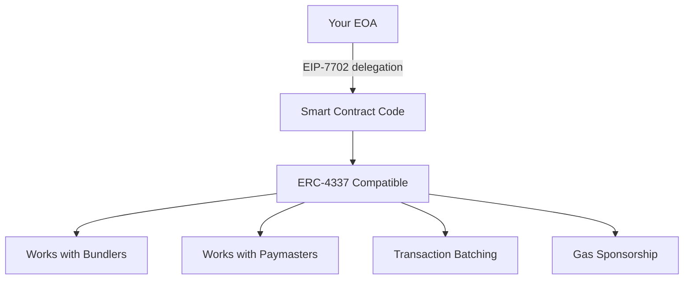

+++
title = "EIP-7702: Finally, Your MetaMask Can Be a Smart Wallet (And Why That's Huge)"
date = "2025-07-28"
tags = ["Ethereum", "EIP-7702", "Account Abstraction", "Smart Wallets", "DeFi"]
draft = false
description = "A deep dive into EIP-7702, the game-changing upgrade that transforms every existing Ethereum wallet into a smart contract wallet without the hassle of migration."
+++

If you've been in the Ethereum ecosystem for a while, you've probably felt the pain. You know what I'm talking about: manually approving each token before you can trade it, paying gas in ETH even when you have plenty of USDC, and that sinking feeling when you realize you've lost your seed phrase and there's absolutely no way to recover your funds.


Well, EIP-7702 is about to change all that. And honestly, as someone who's been building on Ethereum since the early DeFi days, this might be the most important upgrade for actual user experience that we've seen.

## The Problem: Why Your Current Wallet Kinda Sucks

Let's be brutally honest here. Your MetaMask wallet, for all its ubiquity, is basically a glorified key manager from 2015. It has one job: hold your private key and sign transactions. That's it.


Here's what your current EOA (Externally Owned Account) **can't** do:
- ❌ Batch multiple transactions together
- ❌ Pay gas fees with anything other than ETH
- ❌ Recover your account if you lose your seed phrase
- ❌ Set spending limits or require multiple signatures for large transactions
- ❌ Use your phone's Face ID or fingerprint to sign transactions
- ❌ Let someone else pay your gas fees (sponsored transactions)

Meanwhile, smart contract wallets like Argent or Safe have been doing all this stuff for years. But here's the catch: to use them, you need to deploy a new contract, transfer all your funds, and essentially start over with a new address. Most people never make that jump because, frankly, it's a pain in the ass.

## Enter EIP-7702: The Bridge We've Been Waiting For

EIP-7702 is essentially the "best of both worlds" solution. Instead of forcing you to migrate to a new smart contract wallet, it lets your existing EOA **temporarily become** a smart contract wallet.


Think of it like this: your wallet gets to "borrow" the superpowers of a smart contract for specific transactions, then goes back to being a regular EOA. It's like Clark Kent putting on the Superman costume when needed.

### What This Actually Means for Developers

As a developer, you know that the current two-account system is... suboptimal:

**EOAs (your MetaMask):**
- Can initiate transactions ✅
- Controlled by private key
- Zero programmability ❌
- Single point of failure ❌

**Smart Contract Accounts:**
- Programmable logic ✅
- Multi-sig, recovery, batching ✅
- Can't initiate transactions ❌
- Need EOA to call them ❌

EIP-7702 breaks this artificial limitation. Your EOA can temporarily "delegate" its execution to a smart contract, gaining all the programmability while keeping the ability to initiate transactions.

### The Magic: How It Actually Works

The technical implementation is actually pretty elegant. EIP-7702 introduces a new transaction type (`0x04`) that includes an `authorization_list`. This list contains signatures from EOAs saying "hey, I want to temporarily use this smart contract's code."

```solidity
// Simplified concept
struct Authorization {
    uint256 chainId;
    address delegate;  // The smart contract to "borrow" from
    uint256 nonce;
    // ... signature components
}
```

When the transaction executes, your EOA's code gets temporarily set to a "delegation designator" (`0xef0100` + contract address). When the EVM tries to execute this, it goes "oh, this is a pointer" and executes the delegate contract's code instead.


## The Long Road Here: Account Abstraction's Greatest Hits (and Misses)

Before we dive deeper into EIP-7702, let's talk about how we got here. The path to good Account Abstraction has been... let's call it "educational." 


### EIP-86 (2017): The OG Attempt

Vitalik's first swing at this problem back in 2017. The idea was to have transactions with null signatures that would route through a special "entry point" address. Clever, but it had some nasty side effects:

- **The Good**: Introduced CREATE2 (which we still use today!)
- **The Bad**: Could invalidate a ton of pending transactions with one malicious tx
- **The Verdict**: DOA due to DoS vulnerabilities

### EIP-2938 (2020): Getting Closer

This one tried to fix EIP-86's problems by introducing a `PAYGAS` opcode. The contract would essentially say "yep, I'll pay for this transaction" after validating it.

- **The Good**: Solved the DoS issues
- **The Bad**: Still required new opcodes and complex mempool rules
- **The Verdict**: Too invasive for core devs' taste

### EIP-3074 (2024): The Almost Winner

For a while, this looked like the winner. It introduced `AUTH` and `AUTHCALL` opcodes, letting you delegate control to "invoker" contracts.

```solidity
// Simplified EIP-3074 concept
contract Invoker {
    function batchCalls(address[] targets, bytes[] data) external {
        require(authorized(msg.sender), "Not authorized");
        for (uint i = 0; i < targets.length; i++) {
            authcall(targets[i], data[i]); // Magic opcode
        }
    }
}
```

- **The Good**: Worked with existing EOAs, enabled batching and sponsorship
- **The Bad**: Centralization around popular invokers, phishing risk
- **The Verdict**: Withdrawn in favor of EIP-7702


### Why EIP-7702 Won

The core devs learned something important: **less is more**. Instead of adding new opcodes (permanent changes to the EVM), EIP-7702 just adds a new transaction type. It's like the difference between remodeling your house's foundation vs. just adding a new room.

## ERC-4337: The Parallel Universe Solution

While everyone was arguing about protocol changes, some smart folks said "screw it, let's build Account Abstraction on top of Ethereum instead of changing Ethereum itself."


ERC-4337 is essentially a parallel transaction system. Instead of your wallet sending transactions directly to Ethereum, it creates `UserOperations` that get processed by a separate infrastructure:

### The ERC-4337 Squad

**Smart Contract Wallets**: Your actual wallet, but as a smart contract. It has a `validateUserOp` function that can implement any signature scheme you want.

**Bundlers**: These are like Uber drivers for transactions. They collect multiple UserOperations and bundle them into one big transaction to submit to Ethereum.

**Paymasters**: The generous friends who pay your gas fees. A dApp can deploy a Paymaster to sponsor transactions for their users.

**EntryPoint**: The bouncer contract that validates everything and makes sure bundlers get paid.

### Why This Is Clever But Also Kinda Messy

**The Clever Part**: It works today! No hard forks needed. Smart wallets like Safe, Argent, and Biconomy are already using it.

**The Messy Part**: You need a whole parallel infrastructure. If bundlers decide to censor you or charge crazy fees, you're stuck. It's like having to use a different internet to send emails.

```javascript
// ERC-4337 UserOperation structure
const userOp = {
    sender: '0x...', // Your smart wallet address
    nonce: '0x123',
    callData: '0x...', // What you want to do
    signature: '0x...', // Could be anything!
    paymasterAndData: '0x...', // Who's paying?
    // ... gas limits and other stuff
};
```

## EIP-7702: The Goldilocks Solution

After years of "this is too complex" and "this is too centralized," EIP-7702 is the "just right" solution. It's like the core devs finally learned the startup lesson: ship the simplest thing that works.


### The Genius of Doing Less

EIP-7702's secret weapon is restraint. Instead of:
- Adding new opcodes (permanent EVM changes) ❌
- Creating parallel infrastructure (centralization risk) ❌
- Forcing fund migration (user friction) ❌

It just adds a new transaction type. That's it. It's like the difference between performing surgery and taking a vitamin.

### How It Bridges Everything

The beautiful thing about EIP-7702 is that it makes your EOA compatible with the existing ERC-4337 ecosystem. Once your EOA delegates to an ERC-4337-compatible contract, bundlers and paymasters treat it exactly like a native smart wallet.



### Status Update: Coming to Mainnet Soon™

EIP-7702 is part of the Pectra hard fork (Prague + Electra), expected late 2024 or early 2025. It's already live on testnets, and developers are building integrations.

If you're a wallet developer, now's the time to start implementing support. If you're a dApp developer, start thinking about how you can leverage sponsored transactions and batching for your users.

## Under the Hood: How EIP-7702 Actually Works

Okay, time to get our hands dirty. If you're building on this, you need to understand the mechanics.


### The New Transaction Type (0x04)

EIP-7702 adds a new transaction type that looks almost exactly like a regular transaction, except for one crucial addition:

```javascript
// Regular transaction
{
    to: '0x...',
    value: '100',
    data: '0x...',
    gas: 21000,
    // ... other fields
}

// EIP-7702 transaction
{
    to: '0x...',
    value: '100', 
    data: '0x...',
    gas: 21000,
    authorization_list: [  // <- The magic sauce
        {
            chain_id: 1,
            address: '0x...', // Contract to delegate to
            nonce: 42,
            v: 27, r: '0x...', s: '0x...' // EOA's signature
        }
    ]
}
```

### The Authorization List: Your Permission Slip

Each item in the `authorization_list` is basically a signed permission slip saying "I authorize my EOA to temporarily use this contract's code." The signature covers:
- Which chain this applies to (or 0 for all chains)
- Which contract to delegate to  
- Your current nonce (prevents replays)

### Delegation Designators: The Magic Pointer

Here's the clever bit. Instead of copying the entire contract code to your EOA (expensive!), Ethereum just sets your account's code to a special 23-byte "pointer":

```
0xef0100 + [20-byte contract address]
```

The `0xef` prefix is an invalid opcode, so when the EVM sees it, it knows "oh, this is a pointer, not real code" and jumps to execute the contract at the specified address instead.

### The Three-Phase Transaction Dance

1. **Authorization Phase**: Process all authorization signatures, set up delegations
2. **Nonce Bump**: Increment nonces to prevent replay attacks  
3. **Execution Phase**: Run the main transaction (which often calls the newly-delegated EOAs)

### Sponsored Transactions: The Hidden Superpower

Here's what's really cool: the person who signs the authorization doesn't have to be the same person who submits the transaction. This means:

```javascript
// Alice signs the authorization
const auth = alice.signAuth({
    delegate: smartWalletContract,
    nonce: alice.nonce
});

// Bob (the sponsor) submits the transaction
const tx = {
    from: bob.address,    // Bob pays gas
    authorization_list: [auth],  // Alice's permission
    data: '0x...'  // Call Alice's now-smart EOA
};
```

Boom! Native sponsored transactions without any external infrastructure.

## Security: The New Risks You Need to Know About

With great power comes great responsibility, and EIP-7702 definitely comes with some new attack vectors you need to be aware of.


### The Big New Risk: Malicious Delegation

Here's the scary part: when you sign an EIP-7702 authorization, you're essentially saying "this contract can do whatever it wants with my account." If that contract is malicious or has bugs, you're toast.

**Bad scenarios:**
- Phishing sites that trick you into authorizing a malicious contract
- Vulnerable delegate contracts that get exploited
- Front-running attacks on wallet initialization

### How Wallets Will (Hopefully) Save You

Expect wallet providers to be **very** conservative here:

```javascript
// What wallet UIs should look like
if (isEIP7702Authorization(tx)) {
    showBigScaryWarning({
        title: "⚠️  YOU'RE ABOUT TO GIVE CONTROL OF YOUR ACCOUNT",
        contract: tx.authorization_list[0].address,
        auditStatus: getAuditStatus(contract),
        message: "This is like giving someone your private key. Are you SURE?"
    });
}
```

Most wallets will probably only allow delegation to a whitelist of audited contracts from reputable providers.

### Cross-Chain Replay: The Footgun

EIP-7702 lets you use `chain_id: 0` to make an authorization valid on ALL chains. This is powerful but dangerous - your authorization meant for mainnet could get replayed on a random L2.

**Best practice**: Always use specific chain IDs unless you really, really know what you're doing.

### Storage Collisions: The Upgrade Trap

If you delegate to one wallet implementation, set up your guardians and spending limits, then later delegate to a different implementation that uses different storage slots... congratulations, you might have just corrupted your wallet state.

```solidity
// WalletV1 uses slot 0 for guardians
contract WalletV1 {
    address[] guardians; // storage slot 0
}

// WalletV2 uses slot 0 for something else
contract WalletV2 {
    uint256 spendingLimit; // storage slot 0 - collision!
}
```

### Why EIP-7702 Is Still Better Than EIP-3074

Despite these risks, EIP-7702 has a much better security model:

**EIP-3074 Problems:**
- Everyone shares the same invoker contracts (systemic risk)
- Bug in popular invoker = everyone gets rekt
- Centralization around a few "trusted" invokers

**EIP-7702 Advantages:**
- You choose your own delegate contract
- Bug only affects users of that specific contract
- Easy revocation (just delegate to zero address)
- More decentralized approach

## Who's Building What: The Ecosystem Response

The real test of any Ethereum upgrade is whether people actually use it. Let's see who's already building cool stuff.


### Client Implementations: The Foundation

**Geth & Nethermind** have both implemented EIP-7702 for testnets. The engineering teams have been pretty thorough about edge cases and security considerations. Props to the Nethermind team for publishing detailed security analyses - this is the kind of due diligence we need.

### Layer 2 Labs: The Proving Grounds

**Ithaca Odyssey Testnet** has become the go-to playground for EIP-7702 experiments. They've got some really cool demos:

- **PassKey Support**: Use your iPhone's Face ID to sign Ethereum transactions
- **Transaction Batching**: Approve + swap in a single click
- **Porto Library**: A full-featured delegate contract implementation

```solidity
// Example from Ithaca's experiments
contract DelegateWallet {
    function execute(
        address target,
        uint256 value,
        bytes calldata data
    ) external onlyAuthorized {
        // Your EOA can now do smart wallet things
        (bool success,) = target.call{value: value}(data);
        require(success, "Execution failed");
    }
    
    function batchExecute(
        address[] calldata targets,
        uint256[] calldata values,
        bytes[] calldata datas
    ) external onlyAuthorized {
        // Batch multiple calls atomically
        for (uint i = 0; i < targets.length; i++) {
            (bool success,) = targets[i].call{value: values[i]}(datas[i]);
            require(success, "Batch execution failed");
        }
    }
}
```

### Wallet Adoption: The Conservative Approach

Most major wallets (MetaMask, Rainbow, etc.) will probably roll this out as an **opt-in feature** initially. The security implications are too significant for a default rollout.

**Early Adopters:**
- **Ambire Wallet**: Already integrated on testnets
- **OKX Wallet**: Active in early testing
- **Smart wallet providers**: Natural fit for their existing users

### What This Means for dApp Developers

If you're building dApps, EIP-7702 opens up some amazing UX possibilities:

**Onboarding**: Sponsor new users' transactions while they get familiar with your app

**Gaming**: Give users "session keys" for in-game actions without constant wallet popups

**DeFi**: Bundle complex multi-step operations into single transactions

```javascript
// Example: One-click DeFi position
async function openLeveragedPosition(user, amount) {
    const batchCalls = [
        approveToken(USDC, amount),
        depositCollateral(amount),
        borrowAsset(leverageAmount),
        swapToTarget(targetAsset)
    ];
    
    // With EIP-7702, this could be one transaction
    return user.batchExecute(batchCalls);
}
```

## What This Means for the Future

EIP-7702 isn't the endgame - it's the bridge. It's the upgrade that finally makes Account Abstraction accessible to regular users without forcing them to start over.


### For Users: Life Gets Better

Imagine a world where:
- You never lose access to your funds because of a lost seed phrase
- You can pay gas fees with any token you own
- Complex DeFi operations happen in one click
- Your mom can use crypto without a computer science degree

That's the world EIP-7702 enables.

### For Developers: The Design Space Explodes

With EIP-7702, you can build dApps that:
- Sponsor user transactions for better onboarding
- Bundle complex operations into simple UX flows
- Implement app-specific session keys for gaming
- Create gradual authorization systems for large transactions

### The Adoption Timeline I'm Betting On

**2025**: Pectra launches, early adopters start experimenting

**2025-2026**: Wallet providers roll out opt-in support, dApps start showcasing killer UX

**2027+**: EIP-7702 becomes table stakes for competitive wallets, mainstream adoption accelerates

### Why I'm Optimistic

After years of Account Abstraction proposals that were either too complex or too centralized, EIP-7702 feels like the Goldilocks solution. It's simple enough to actually ship, secure enough to trust with real money, and powerful enough to unlock the UX improvements we've been promising for years.

More importantly, it doesn't force anyone to change what they're already doing. Your MetaMask keeps working exactly the same - it just gets superpowers when you want them.

### The Developer Opportunity

If you're building in the Ethereum ecosystem, now's the time to start thinking about how EIP-7702 changes your product roadmap. The teams that figure out how to leverage sponsored transactions, batching, and flexible authorization schemes will have a massive UX advantage.

The future of Ethereum isn't just about better scaling or lower fees. It's about making blockchain interactions as intuitive as using any other modern app. EIP-7702 gets us a huge step closer to that goal.


---

_Want to stay updated on the latest Ethereum developments? Follow my work on [Medium](https://extremelysunnyyk.medium.com/) and connect with me on [LinkedIn](https://linkedin.com/in/chiayongkang). I write about the intersection of DeFi, infrastructure, and user experience in the crypto space._
