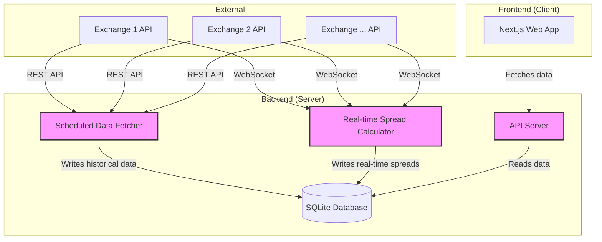

This guide provides an in-depth explanation of the architecture and trading logic behind this perpetual funding rate arbitrage screener. The goal is to demystify the system, enabling you to understand its components, the strategy it employs, and how you could build a similar system from scratch.

---

## 1. The Core Arbitrage Strategy: Funding Rate Arbitrage

The entire system is built to exploit one of the most consistent opportunities in crypto markets: **Funding Rate Arbitrage**, also known as a "basis trade."

### What are Perpetual Swaps & Funding Rates?

- **Perpetual Swaps (Perps)**: These are derivative contracts that mimic the price of a spot asset (like BTC) but have no expiration date.
- **Funding Rates**: Because perps never expire, exchanges need a mechanism to keep the perp price tethered to the underlying spot price. This mechanism is the **funding rate**.
  - If the perp price is _higher_ than the spot price (bullish sentiment), longs pay shorts. This incentivizes traders to short the perp, pushing its price down towards the spot price. The funding rate is **positive**.
  - If the perp price is _lower_ than the spot price (bearish sentiment), shorts pay longs. This incentivizes traders to long the perp, pushing its price up towards the spot price. The funding rate is **negative**.

Funding payments typically occur every 1, 4, or 8 hours, depending on the exchange.

### The Arbitrage Logic

The arbitrage opportunity arises when two different exchanges have a significant and persistent difference in their funding rates for the same asset.

The strategy is simple and market-neutral:

1. **Go LONG** on the perpetual contract with the **lower** (or more negative) funding rate.
2. **Go SHORT** on the perpetual contract with the **higher** (or more positive) funding rate.

By holding these two opposing positions, you have created a **delta-neutral** position. Any price movement in the underlying asset (e.g., BTC) will result in a gain on one leg of your trade and an equal loss on the other, canceling each other out. Your PnL is therefore isolated from price volatility.

**Your profit is the difference (the "delta") between the two funding rates.**

`Profit = (Short Leg Funding Rate - Long Leg Funding Rate)`

### Why Historical Data is Crucial

A single funding rate payment is just noise. The real alpha comes from identifying _structural_ inefficiencies where one exchange _consistently_ has a higher or lower rate than another over days or weeks.

This is why the screener relies on **historical data**. By averaging the funding rates over a lookback period (e.g., 7, 14, or 30 days), we can:

- Filter out short-term noise and random spikes.
- Identify pairs with a stable, persistent, and therefore more predictable, funding rate differential.
- Build confidence that the opportunity is likely to persist after we enter the trade.

---

## 2. System Architecture Overview

The system is composed of several key components that work together to fetch, process, and display arbitrage opportunities. It's designed as a modular client-server application.

### Architecture Diagram

### Data Flow

1. **Scheduled Fetching**: A background process (`Fetcher`) runs on a schedule (e.g., every hour). It calls the REST APIs of various exchanges to pull historical data: funding rates, 24h volume, and open interest. This data is written to a local SQLite database.
2. **Real-time Spreads**: A separate background process (`Spreader`) maintains persistent WebSocket connections to the exchanges. It subscribes to live order book data for all relevant pairs and continuously calculates the real-time cost to enter a trade (the bid-ask spread). This is also written to the database.
3. **API Server**: A Next.js API route (`API`) exposes an endpoint for the frontend. When called, it reads the historical data and real-time spreads from the database.
4. **Frontend**: A React-based UI (`UI`) calls the API, receives the processed opportunity data, and displays it in a sortable, filterable table for the user.

---

## 3. Component Deep-Dive & Rebuilding Guide

Here's how you would build each component from scratch.

### Part 1: The Data Foundation (Fetcher & Database)

This is the bedrock of the system. Without reliable data, nothing else matters.

### Database Schema (`src/server/db/schema.ts`)

First, define the database schema using an ORM like Drizzle. A simple SQLite database is perfect for this use case. You need three tables:

- `funding_rates`: Stores the historical funding data for each asset.
  - `exchange` (TEXT): Name of the exchange (e.g., "BINANCE").
  - `symbol` (TEXT): Name of the symbol (e.g., "BTCUSDT").
  - `timestamp` (INTEGER): The time the funding rate was recorded.
  - `rate` (NUMERIC): The raw funding rate for that period.
  - `apr` (NUMERIC): The calculated APR for that rate.
  - **Primary Key**: `(exchange, symbol, timestamp)` to ensure each data point is unique.
- `markets`: Stores liquidity and market data.
  - `exchange`, `symbol`, `timestamp`.
  - `openInterestValue` (NUMERIC): Total value of open contracts (a key liquidity metric).
  - `quoteVolume` (NUMERIC): 24-hour trading volume.
  - **Primary Key**: `(exchange, symbol)` as we only need the latest snapshot.
- `spreads`: Caches the latest real-time entry/exit spreads.
  - `longExchange`, `longSymbol`, `shortExchange`, `shortSymbol`.
  - `data` (JSON): A JSON object containing the calculated `entry` and `exit` spreads.
  - **Primary Key**: `(longExchange, longSymbol, shortExchange, shortSymbol)`.

### The Collector (`src/server/clients.ts`, `src/server/fetcher.ts`)

This is a script that runs periodically to populate your database.

1. **Exchange Clients**: Create a class or object for each exchange you want to integrate. This encapsulates the logic for fetching data from their specific API endpoints.
   - **Example: Binance Client**
     - `fetchMarkets`: To get a list of all perpetual symbols.
     - `fetchTickers`: Use the `fapi/v1/ticker/24hr` endpoint to get 24h `quoteVolume`.
     - `fetchOpenInterest`: Use `fapi/v1/openInterest` to get the `openInterestValue`.
     - `fetchFundingRateHistory`: Use `fapi/v1/fundingRate` to get historical rates.
2. **APR Calculation**: Funding rates are usually given for a single period (e.g., 8 hours). You must normalize this to an APR to make it comparable across exchanges.
   `APR = funding_rate * (24 / funding_interval_hours) * 365 * 100`
3. **Rate Limiting**: Exchanges will ban your IP if you make too many API requests too quickly. Use a library like `p-queue` to create a request queue that limits concurrency and adds delays between calls.
4. **The Fetcher Script**: This script ties everything together.
   - It initializes clients for all supported exchanges.
   - It calls the `fetchMarkets`, `fetchOpenInterest`, etc., methods on a loop.
   - It transforms the API responses into the structures defined by your database schema.
   - It uses the Drizzle ORM to insert the new data into your SQLite database.
   - You can run this script using a cron job or a simple `setInterval` in a long-running Node.js process.

### Part 2: Real-Time Execution Cost (The Spreader)

A great funding rate delta is worthless if the cost to enter the trade wipes out your potential profit. The Spreader calculates this cost.

### The Logic (`src/server/spread.ts`)

1. **Why WebSockets?**: We need the _live_ order book to know the real price. REST API polling is too slow. WebSockets provide a persistent connection for real-time data streams.
2. **Subscribing to Order Books**: For each symbol, connect to the exchange's WebSocket endpoint and subscribe to the order book channel (e.g., `symbol@depth20@100ms` for Binance). This will stream the top 20 levels of bids and asks every 100ms.
3. **Calculating the "Take/Take" Spread**: To open a position _immediately_, you must be a "taker"—you accept the best available price.
   - To go **LONG**, you buy at the **best ask** price.
   - To go **SHORT**, you sell at the **best bid** price.
   - The formula for the entry spread percentage is:
     `Spread % = (Short Leg Best Bid - Long Leg Best Ask) / Long Leg Best Ask * 100`
4. **Storing the Spread**: This calculation is done continuously for all potential pairs. The latest result is then written to the `spreads` table in the database.

### Part 3: The API Server & Frontend

This is the user-facing part of the application.

### The API (`src/server/view.ts`, `/api/opportunities/...`)

Create an API endpoint that the frontend can call to get a list of opportunities. This endpoint's logic does the following:

1. **Get Possible Pairs**: Generate a list of all valid trading pairs from the markets present in your database.
2. **Query Database**:
   - Fetch the _average_ `apr` from the `funding_rates` table for each symbol over the user-selected lookback period (e.g., last 7 days).
   - Fetch the latest `openInterestValue` and `quoteVolume` from the `markets` table.
   - Fetch the latest `entry` spread from the `spreads` table.
3. **Combine and Process**: For each pair, create a single `Opportunity` object that contains:
   - Long Leg & Short Leg details (exchange, symbol).
   - The averaged APR for each leg (`longRate`, `shortRate`).
   - The **Delta**: `shortRate - longRate`. This is your theoretical profit.
   - Liquidity data (`longOpenInterestValue`, `shortQuoteVolume`, etc.).
   - The real-time entry spread (`spreadEntry`).
4. **Return JSON**: Send the array of these `Opportunity` objects back to the frontend as a JSON response.

### The Frontend (`src/app/opportunities/page.tsx`)

The UI should be a clean, data-rich table.

1. **Data Fetching**: Use a library like React Query (`@tanstack/react-query`) to fetch data from your API endpoint. This provides caching, refetching, and a clean way to handle loading/error states.
2. **The Opportunities Table**: Display the data in a table with columns for:
   - Pair (e.g., BTC/USDT)
   - Long Exchange / Short Exchange
   - Long Rate / Short Rate (the averaged APRs)
   - **Delta % (Annualized)**: The key metric. This is the column to sort by.
   - **Entry Spread %**: The immediate cost to enter.
   - Liquidity (Open Interest, Volume).
3. **Interactivity**: Add controls for the user to:
   - Select the lookback period (e.g., 7D, 14D, 30D).
   - Filter by exchange.
   - Sort by any column (especially Delta).

---

## 4. How to Use the Screener for Trading

Now you have a powerful tool. Here is the workflow for finding and executing a trade:

1. **Select a Lookback Period**: Start with 7 or 14 days. This focuses on stable, medium-term opportunities.
2. **Sort by Delta**: Sort the opportunities table by the "Delta" column in descending order. The top results are your best theoretical opportunities.
3. **Check Liquidity**: **This is a critical step.** Look at the `Open Interest` and `24h Volume` columns. Avoid pairs with low liquidity (e.g., <$500k OI or Volume). Illiquid markets lead to high slippage, meaning your actual entry price will be much worse than the displayed price.
4. **Analyze the Real Cost**: Compare the **Delta** to the **Entry Spread**.
   - **Rule of Thumb**: The annualized Delta should be significantly greater than the entry spread.
   - **Example**: If a pair has a 20% annualized Delta and a 0.05% entry spread, it's a strong candidate. The profit from the funding rates will quickly overcome the initial trading cost. If the Delta is 5% and the entry spread is 0.2%, it's a poor candidate, as the trade would take a long time just to break even.
5. **Execute the Trade**: If an opportunity passes all the checks, you manually execute the two legs on their respective exchanges as close to simultaneously as possible.
   - Place a LONG order for the asset on the exchange with the lower funding rate.
   - Place a SHORT order for the asset on the exchange with the higher funding rate.
6. **Manage the Position**: This is not a "set and forget" strategy.
   - **Risk**: The primary risk is that the funding rate differential collapses or inverts.
   - **Monitoring**: Periodically check the funding rates to ensure the positive delta persists. If it disappears, you should unwind the position to lock in your profits (or cut your losses). Unwinding involves closing both positions simultaneously.

---

## 5. Conclusion & Next Steps

This architecture provides a robust foundation for identifying funding rate arbitrage opportunities. By combining historical analysis with real-time execution data, it gives a trader a true edge.

### Potential Improvements

- **Automated Execution**: Build a bot that can automatically execute and close trades based on predefined rules from the screener.
- **Backtesting Engine**: Create a system to test how this strategy would have performed on historical data to fine-tune your parameters.
- **Fee & Latency Awareness**: Incorporate trading fees, exchange transfer times, and withdrawal fees into the profitability calculation.
- **Advanced Risk Management**: Model potential shocks to funding rates and automatically calculate position sizes based on account risk tolerance.
